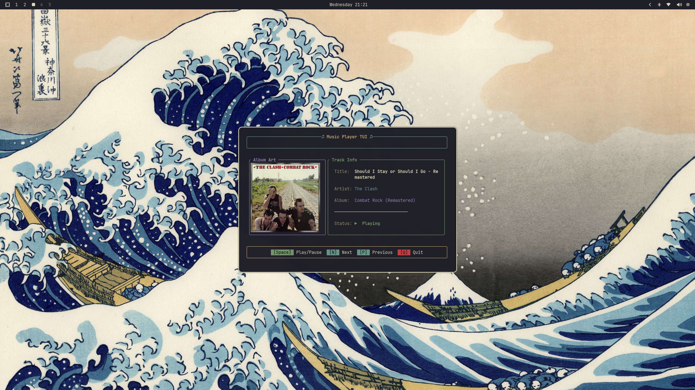

# player-tui

A vibrant and lightweight Terminal User Interface (TUI) for controlling media players on Linux via `playerctl`. Built with Rust and `ratatui`, it provides a sleek way to visualize and control your currently playing audio.

 <!-- Placeholder for actual screenshot if available -->

## Features

- **Album Art Visualization**: High-quality album art rendering directly in your terminal (supports various protocols via `ratatui-image`).
- **Dynamic Metadata Display**: Real-time updates for Track Title, Artist, and Album.
- **Playback Controls**: Easily Play/Pause, Skip to Next, or go back to the Previous track.
- **Status Indicators**: Visual cues for "Playing", "Paused", and "Stopped" states.
- **Modern UI**: Rounded borders and a curated color palette for a premium look.

## Prerequisites

- **Linux OS** (Requires `playerctl` for media control).
- **Playerctl**: Ensure `playerctl` is installed and a compatible media player (e.g., Spotify, VLC, MPD) is running.
- **Rust**: [Rustup](https://rustup.rs/) (to build from source).

## Installation

1. **Clone the repository**:
   ```bash
   git clone https://github.com/bedanth/player-tui.git
   cd player-tui
   ```

2. **Build and Install**:
   ```bash
   cargo build --release
   ```
   The binary will be located at `./target/release/player-tui`.

## Usage

Run the application:
```bash
./target/release/player-tui
```

### Keybindings

The interface looks great as a floating centered window, for me on omarchy, I attached this to a keybind like `Leader + Shift + P`, omarchy currently doesn't have a default application to launch something as a floating-centered window. 

You can use this bash-script to open one if you are on Hyprland using `uwsm-app`
```bash
   #!/bin/bash
   if (($# == 0)); then
      echo "Usage: omarchy-launch-floating-tui [command] [args...]"
      exit 1
   fi

   WINDOW_PATTERN="$1"
   WINDOW_ADDRESS=$(hyprctl clients -j | jq -r --arg p "$WINDOW_PATTERN" '.[]|select((.class|test("\\b" + $p + "\\b";"i")) or (.title|test("\\b" + $p + "\\b";"i")))|.address' | head -n1)

   if [[ -n $WINDOW_ADDRESS ]]; then
      hyprctl dispatch focuswindow "address:$WINDOW_ADDRESS"
   else
      exec setsid uwsm-app -- xdg-terminal-exec --app-id=org.omarchy.floating.$(basename "$1") -e "$1" "${@:2}"
   fi
```
You can specify a different app-id under the argument, this app-id will be used to write the hyprland window rule to make the window floating and centered: 

Add the following in `hyprland.conf` or wherever you might have any existing window rules:
```bash
windowrule = float on, match:class org.omarchy.floating.*
windowrule = center on, match:class org.omarchy.floating.*
windowrule = size 600 400, match:class org.omarchy.floating.*
```

And then you can add keybind in your `bindings.conf` like: 
```bash
   bindd = SUPER SHIFT, P, Player TUI, exec, omarchy-launch-floating-tui /home/bedanth/.custom-apps/player-tui
```
_Note_: Syntax and arguments may differ based on your current settings, so make sure to refer to the docs or any current keybindings you already have for syntax.

| Key | Action |
|-----|--------|
| `Space` | Toggle Play/Pause |
| `n` | Next Track |
| `p` | Previous Track |
| `q` | Quit |

## License

Copyright (c) bedantH <bedanthota@gmail.com>

This project is licensed under the MIT license ([LICENSE] or <http://opensource.org/licenses/MIT>)

[LICENSE]: ./LICENSE
